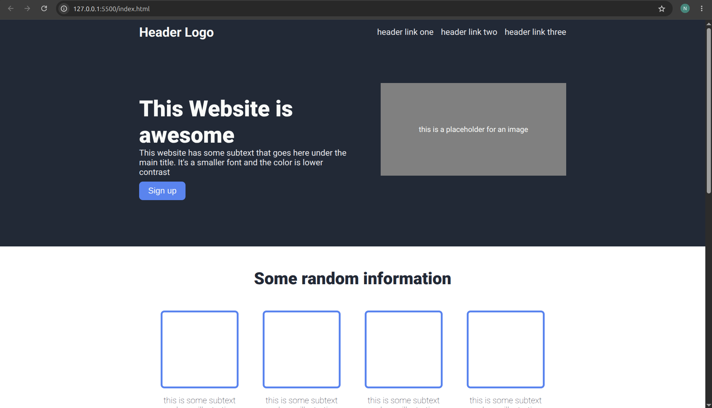
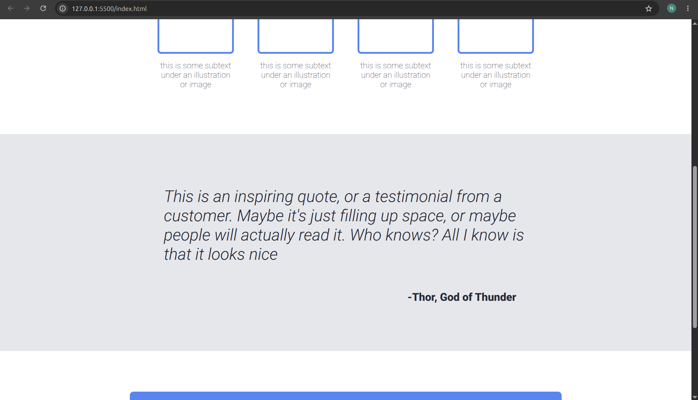
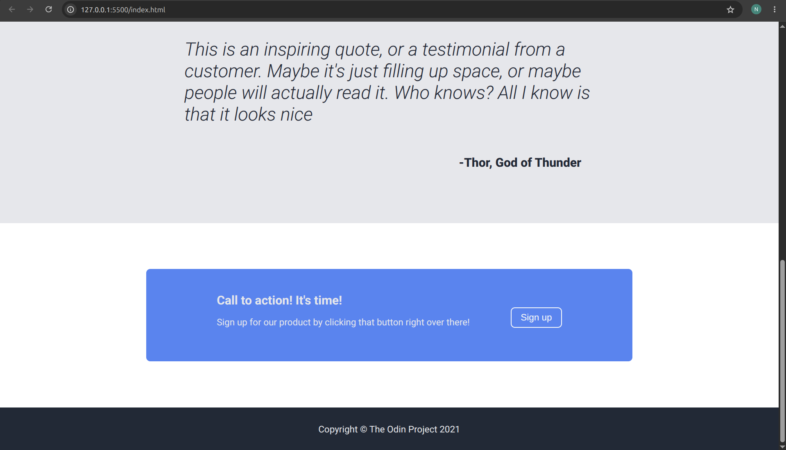

# Landing Page

A landing page built with HTML and CSS as part of [The Odin Project](https://www.theodinproject.com/lessons/foundations-landing-page) foundations course.

## Live Demo
[View it live](https://nathanjspriegel.github.io/landing-page/)

## What I practiced
- Flexbox for layout (rows, columns, centering, spacing)
- Working from a design mockup/spec sheet
- Debugging common CSS issues (margin collapsing, flex-shrink, default browser styles)

## Built with
- HTML5
- CSS3

## Ideas to improve

- Making website responsive for different screen sizes
- Adding interactivity with JS
- Filling in information based on a real organization/company

## Screenshots

